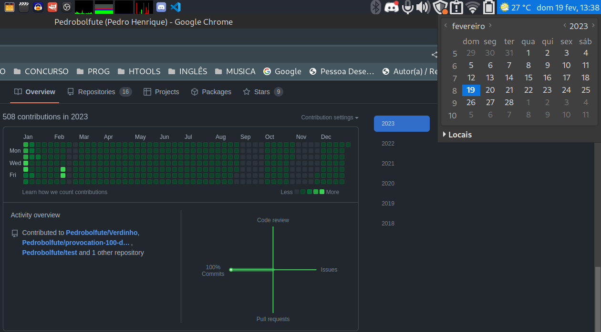
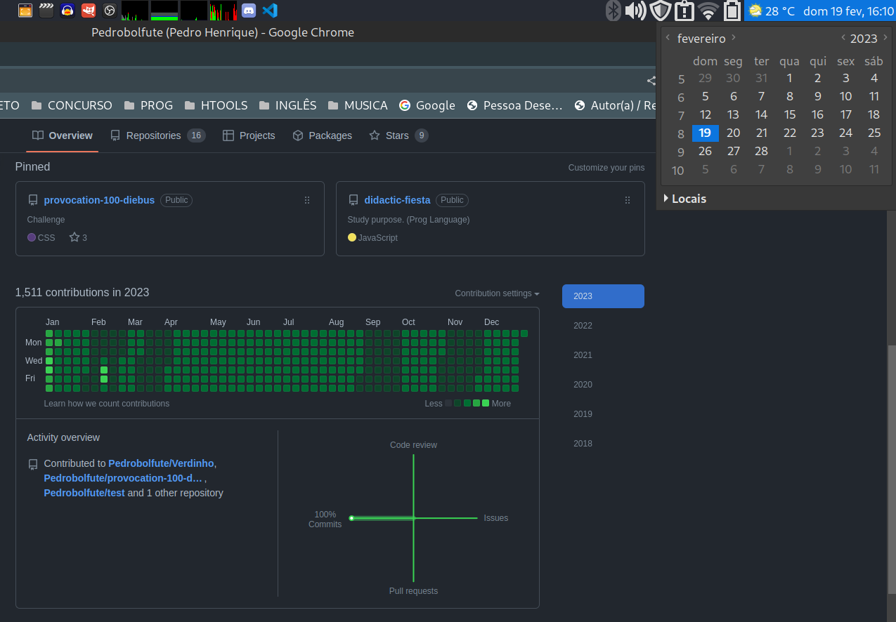

# Chuva de commits

## Deixando o seu progresso no github todo verdinho.

Esse script vai apenas criar commits para cada dia do ano. Assim deixando seu progresso com uma aparencia massa demais!

## Para rodar ele

### Baixar

> git clone https://github.com/Pedrobolfute/Verdinho.git

ou, se tiver SSH configurado

> git clone git@github.com:Pedrobolfute/Verdinho.git

### Rodar

Mude o conteúdo das variáveis no script referente ao do seu sistema nas linhas **5, 7, 57**.

- **Linha 5**: Caminho do "seu" diretório aonde acontecera os eventos.

  - **OBS:** o diretório tem que ser um monitorado pelo **git**.

- **Linha 7**: Nome do seu usuário padrão, no qual você usa para subir os commits.

- **Linha 57**: Mude aqui para a data e hora do seu sistema, seguindo aquele mesmo padrão (inglês).

  - Após o término dos commits a data e hora vai ser definido como sendo esse que você colocou. Então aconcelho deixar a hora com um adiantamento de 2 a 5 minutos, contando apartir do início do comando (dependendo da velocidade do seu sistema você ajusta esse tempo, se "estiver lento ou com muitos processos em execução" coloque um tempo maior, se eltiver "rápido e com poucos processos" um tempo menor).

Agora rode o script como root, para você não ficar precisando de colocar a senha toda hora.

> sudo bash commits.sh

Após rodar o script ele vai criar também um log dos eventos de commit no arquivo logCommits.txt.

> cat logCommits.txt

Envie seus commits pro github *and not be pride of yoursef but with others. ;)*

> git push origin main
